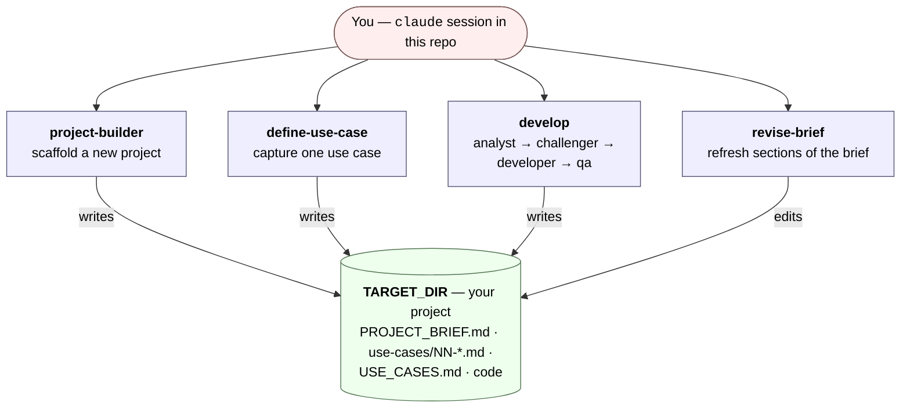

# project-builder

A Claude Code workspace for starting new software projects, capturing what they should do as use cases, and building them one feature at a time.

This is the tooling — not a project itself. Every action runs against a **target folder you choose**; nothing is written inside this repo.

## What you can do

Four things, all from a Claude Code session running in this folder:

- **Scaffold a new project.** Claude walks you through overview, monetization, tech stack, architecture, quality standards, and deployment, then writes a `PROJECT_BRIEF.md` and creates the initial project structure.
- **Capture use cases.** One Markdown file per use case under `<your-project>/use-cases/`, with a summary, acceptance criteria, and pitfalls. Claude asks clarifying questions before saving. After saving, it can chain straight into building the feature.
- **Build features.** A four-agent team (analyst, challenger, developer, QA) implements a saved use case, a feature, a bug fix, or a refactor in your target project.
- **Refresh the brief.** Update sections of an existing `PROJECT_BRIEF.md` (e.g., new deployment target, swapped tech) without re-scaffolding.

## How it works



This repo holds the agents and skills; nothing is written into it. Every action targets a folder you supply, and `PROJECT_BRIEF.md` (plus `USE_CASES.md` once you start capturing use cases) is the contract the agents read on each run.

## Requirements

- macOS or Linux
- [Claude Code](https://claude.com/claude-code) installed and signed in
- Git

## Quick start

```bash
git clone git@github.com:HaroldHormaechea/project-builder.git
cd project-builder
claude
```

Then ask Claude what you want to do:

| To... | Say something like... |
|---|---|
| Scaffold a new project | "scaffold a new project in `/absolute/path/to/target`" |
| Capture a use case | `/define-use-case` (or "define a use case in `/abs/path`") |
| Build a feature | `/develop` (or "implement X in `/abs/path`") |
| Refresh the brief | `/revise-brief` |

Claude takes it from there. Everything is written into your target folder, never into this repo.

## Files Claude creates in your project

- `PROJECT_BRIEF.md` — source of truth for what the project is and how it's built.
- `use-cases/01-...md`, `use-cases/02-...md`, ... — one file per use case, numbered in order.
- `USE_CASES.md` — status ledger tracking each use case as `pending`, `in-progress`, `done`, or `blocked`.

## Profiles (opt-in conventions)

Profiles are opinionated rule sets for specific stacks. They activate per-project by listing them in `PROJECT_BRIEF.md` → `profiles:`. Available today:

- **`profile-java-database-access`** — DTO projections, parameterized queries, Hibernate.
- **`profile-java-server-architecture`** — Gradle, Spring Boot, Java LTS; strict Controller → Facade → Service → Repository layering; repositories return DTOs only.
- **`profile-aws-deployment`** — AWS-first; every suggestion includes a per-service cost estimation table.

To add your own, drop a `SKILL.md` under `.claude/skills/profile-<name>/` and list it in any project's brief to activate it.

## Project layout

```
CLAUDE.md                                   Rules Claude loads at session start
README.md                                   This file
.claude/
  agents/project-builder.md                 Scaffolding subagent
  skills/
    define-overview / define-monetization /
    define-technologies / define-architecture /
    define-quality-standards / define-deployment    Scaffold interview steps
    define-use-case                                 Use-case capture
    develop                                         Dev-team entry point
    revise-brief                                    Brief-update entry point
    write-readme                                    README generation for scaffolded projects
    profile-java-database-access /
    profile-java-server-architecture /
    profile-aws-deployment                          Opt-in stack profiles
  teams/dev-team/
    orchestrator.md                                 How the dev-team is run
    analyst.md / challenger.md / developer.md / qa.md   Role definitions
```

## Known limitations

- **No automatic recovery.** If a spawned agent crashes or runs out of context, you restart the run.
- **No batch use-case mode.** Each use case is built in its own `/develop` run. `USE_CASES.md` tracks status, but there's no "implement all pending" command yet.
- **Profile cost.** Every active profile adds context to every session — there's no pruning today.
- **Loose Markdown parsing.** Agents read `PROJECT_BRIEF.md` prose by section heading; renaming or reordering can break reads. The YAML frontmatter at the top of the brief is more robust.

## License

Not yet licensed.
